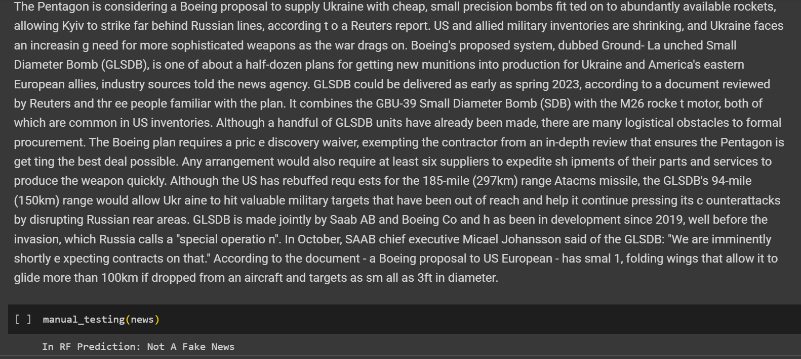

DESCRIPTION:

Fake news and rumours are the most popular forms of spread of False and unauthenticated
information. It should be detected as soon as possible for avoiding their dramatic
consequences. The aim of this work is to create a system or a model that can use the data of
past news reports and predict the chances of a news report being fake or not.

TECHNIQUES AND ALGORITHMS USED:

1. TF-IDF vectorizer
-Used for feature extraction.
    1. It denotes to Term Frequency and Inverse Document Frequency Vectorizer.
    2. TF-IDF uses the frequency of words to determine how relevant those words are
    to a given document.
    3. TF(x) = (Number of times word x appears in a document) / (Total number of
    words in the document)
    4. IDF(x) = log_e(Total number of documents / Number of documents with word x
    in it)

2. Random Forest Classifier
-Used for solving regression and classification problems. But our project is based on
classification.
    1. Random Forest is a classifier that contains a number of decision trees on various
    bootstrap subsets of the given dataset and takes the average to improve the
    predictive accuracy of that dataset.
    2. Instead of relying on one decision tree, the random forest takes the prediction
    from each tree and based on the majority votes of predictions, and it predicts the
    final output.
3. Decision Tree
    1. A decision tree is a non-parametric supervised learning algorithm, which is
    utilized for both classification and regression tasks.
    2. It has a hierarchical, tree structure, which consists of a root node, branches,
    internal nodes and leaf nodes.

Link to dataset:
https://drive.google.com/drive/folders/1kuaXZvXRjv85lxkjHHG0RwCCZ0QICPM?usp=share_link
It contains instances of True and Fake news respectively to train our model.

LINK FOR THE PROJECT:
Colab Link :
https://colab.research.google.com/drive/1ahpCnfSwOxRA5LuzLqRYj4NK0EUhcyWX?usp=sharing

Output:

